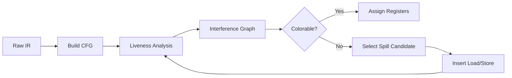

# iON

iON is a standalone implementation of a global register allocator based on the Chaitin-Briggs Graph Coloring algorithm. It transforms an Intermediate Representation (IR) with infinite virtual registers into a target ISA with a constrained set of physical registers (K=4), handling complex control flow, interference analysis, and register spilling.

## The "Why"

Register allocation is the single most high-leverage optimization in a compiler backend. It is an NP-Complete problem that directly dictates runtime performance. This project demonstrates:

- **Dataflow Analysis**: Iterative liveness analysis on a Control Flow Graph (CFG).
- **Graph Theory**: Construction and coloring of interference graphs.
- **Heuristic Optimization**: Spill-cost calculation based on loop depth.

## Build
```bash
# Build everything (both test frameworks)
mkdir build && cd build
cmake ..
cmake --build .

# Run all tests
ctest --output-on-failure

# Or run individually
./ion_test_gtest
./ion_test_catch2
```

### Build with only one framework
```bash
cmake -DION_USE_CATCH2=OFF ..   # GoogleTest only
cmake -DION_USE_GTEST=OFF ..    # Catch2 only
cmake -DION_BUILD_TESTS=OFF ..  # No tests
```

## Architecture

The pipeline follows the standard LLVM backend flow:



## Key Features

- **Iterative Liveness Analysis**: Solves dataflow equations (LiveIn / LiveOut) across basic blocks with backward propagation.
- **Interference Graphing**: Builds the conflict graph where nodes are variables and edges represent overlapping lifespans.
- **Conservative Move Coalescing**: Implements Briggs' heuristic to merge non-interfering nodes, eliminating redundant MOV instructions.
- **Chaitin-Briggs Simplification**: Uses the "Simplify-Select" heuristic to color the graph.
- **Smart Spilling**: If K < Degree(N), it spills variables with the lowest spill cost (calculated via `use_count / 10^loop_depth`).
- **Graphviz Integration**: Dumps `.dot` files at every stage to visualize the allocation process.

## Design Trade-offs

Systems engineering is the art of managing trade-offs. Here is why iON is built this way:

### Chaitin-Briggs vs. Linear Scan

- **Decision**: Chose Graph Coloring (Chaitin-Briggs) over Linear Scan.
- **Reasoning**: While Linear Scan is faster (O(N)), it produces lower-quality code (more spills). iON prioritizes runtime performance of the generated code over compilation speed, matching the goals of an optimizing backend like LLVM's greedy allocator or GCC's IRA.

### Spill Heuristic (Cost / 10^depth)

- **Decision**: Loop-depth weighted spilling.
- **Reasoning**: Spilling inside a loop is catastrophic. iON assumes code inside loops executes exponentially more often. A simple usage count is insufficient for high-performance workloads.

## Verification Strategy

- **Round-Trip Testing**: iON doesn't just output assembly; it validates that the interference constraints are respected in the final coloring.
- **Stress Testing (Fuzzing)**: Validated against synthetically generated IR with high register pressure (up to 50 concurrent live variables) to ensure graceful spilling behavior without crashes.
